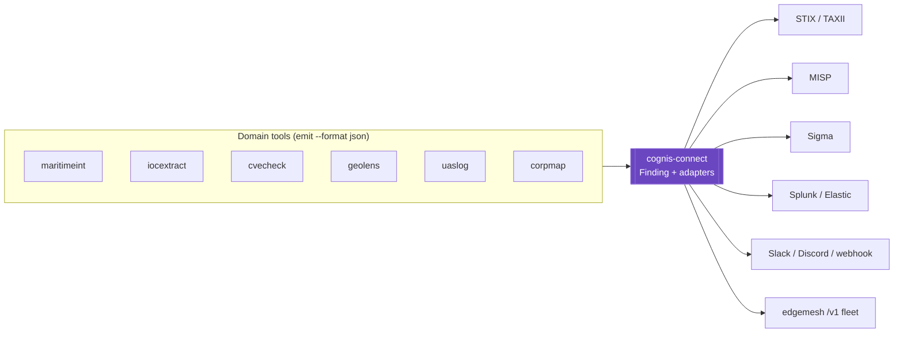

# Cognis interop map

**cognis-connect is the integration backbone of the suite.** Where every other repo's
INTEROP.md describes *composition patterns*, this repo *implements* them: one `Finding`
contract + adapters to every external platform and to the edgemesh `/v1` fleet.



## Key edges

| from | relation | to |
|---|---|---|
| any tool's JSON | normalized into a `Finding` by | **cognis-connect** |
| cognis-connect | exports to | STIX/TAXII, MISP, Sigma, Splunk, Elastic |
| cognis-connect | notifies | Slack, Discord, generic webhooks |
| cognis-connect | reaches models via | [`edgemesh`](https://github.com/cognis-digital/edgemesh) `/v1` (`summarize`) |
| [`stixgen`](https://github.com/cognis-digital/stixgen) / [`attackmap`](https://github.com/cognis-digital/attackmap) | complement cognis-connect for | deeper STIX / ATT&CK work |

## Composition patterns

```bash
# any tool -> any platform, in one pipe
maritimeint locate fleet.csv --sanctions s.json --format json \
  | cognis-connect emit --to stix --source maritimeint > bundle.stix.json
iocextract scan log.txt --format json | cognis-connect emit --to splunk --url $HEC --token $TOK
cat findings.json | cognis-connect emit --to brief        # analyst summary via your fleet
```

Adopt the `Finding` contract in your own tool and it instantly gains every destination:

```python
from cognis_connect import Finding, siem
siem.send_slack([Finding(title="hit", source="mytool", severity="high",
                         indicators={"ipv4": "203.0.113.5"})], webhook_url)
```

> Part of the cross-repo interop pass. **300+ tools →** [github.com/cognis-digital](https://github.com/cognis-digital)
